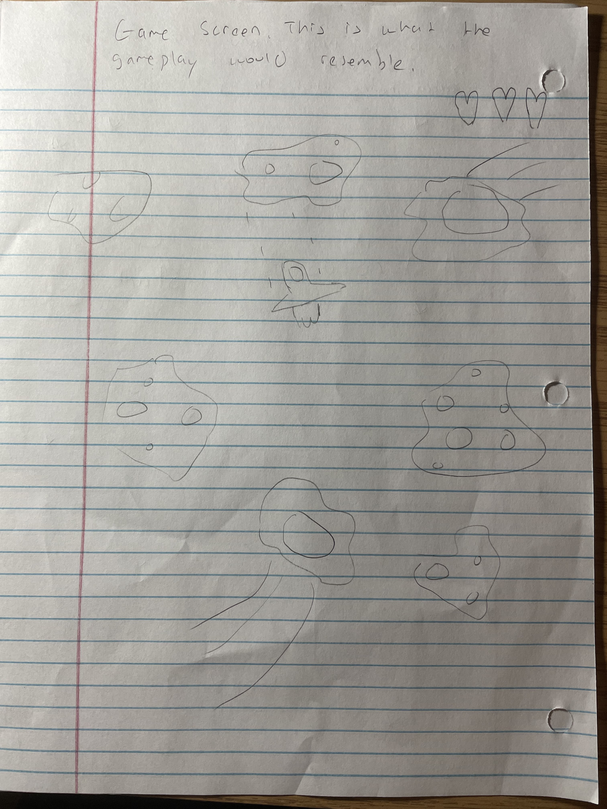
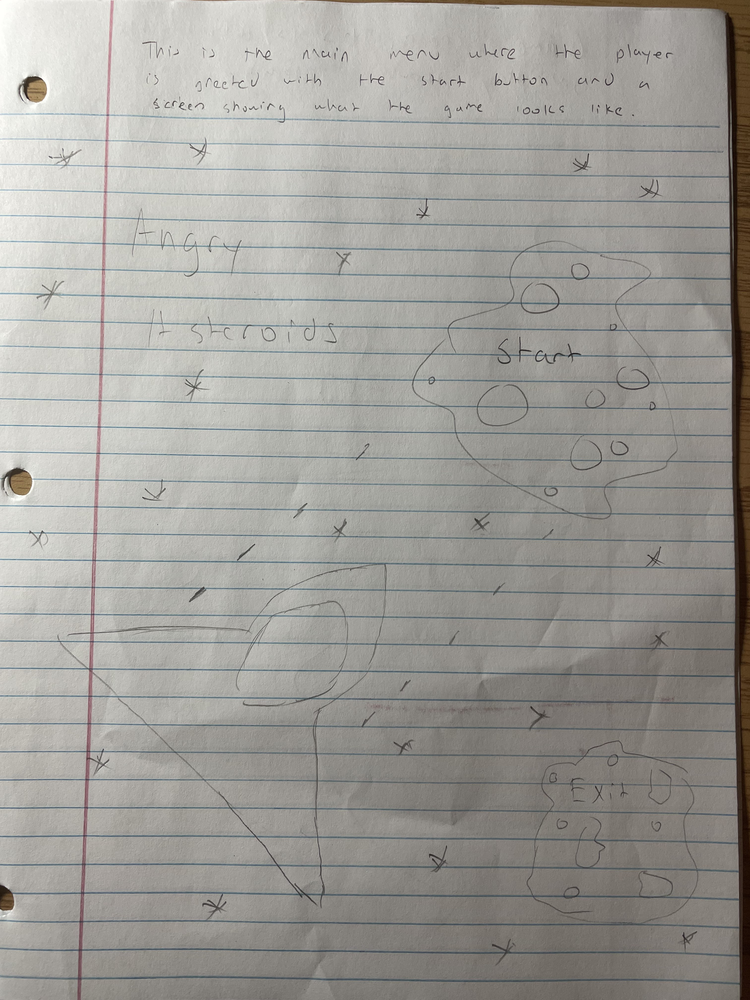
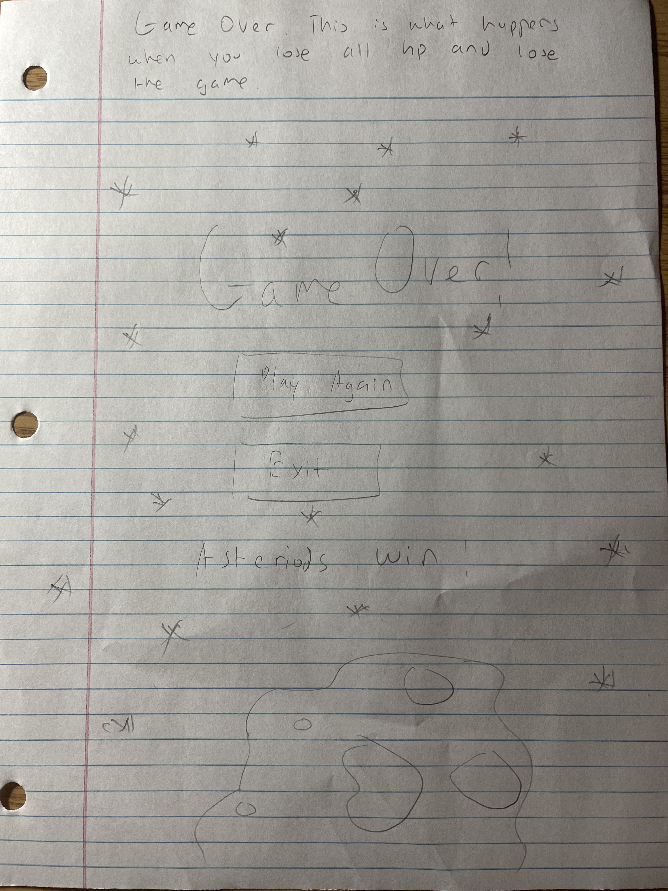
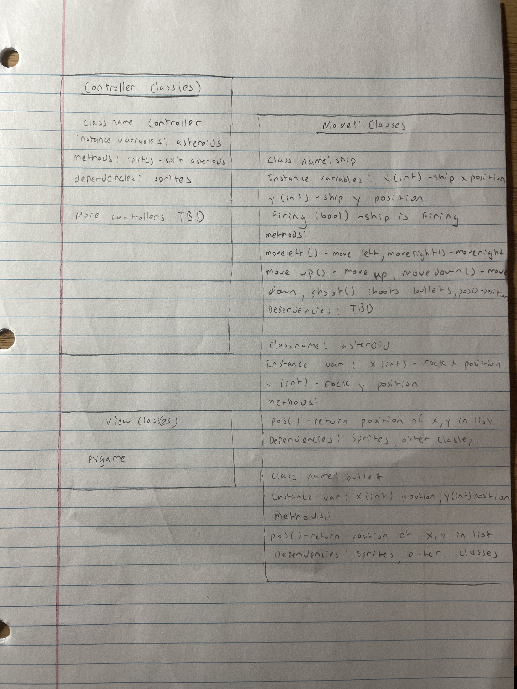

:warning: Everything between << >> needs to be replaced (remove << >> after replacing)
# CS110 Project Proposal
#  Save the Sea 
## CS 110 Final Project
###  Fall, 2021 
### [Assignment Description](https://docs.google.com/document/d/1H4R6yLL7som1lglyXWZ04RvTp_RvRFCCBn6sqv-82ps/edit#)

https://github.com/bucs110a0fall21/final-project-the-boy-friends

<< [link to demo presentation slides](#) >>

### Team:  The Boyfriends 
####  Chao Lin, Carl Huang, Ira Cheng

***

## Project Description *(Software Lead)*
<< This is a project that emulates a space invader game with asteroids, but with a twist as the concept is based on destroying garbage cans that are falling into Earth's oceans. The player plays as a fighter jet that they can control using keyboard inputs. The objective is to evade the garbage cans while using the fighter jet to destroy any that get in the way. The player should try to score as many points as possible without draining their health bar. As the gameplay progresses, the odds of the player's survivability decreases. >>

***    

## User Interface Design *(Front End Specialist)*
* 
  
   
    * For example, if your program has a start screen, game screen, and game over screen, you should include a wireframe / screenshot / drawing of each one and a short description of the components

  
  
  

* << You should also have a screenshot of each screen for your final GUI >>

***        

## Program Design *(Backend Specialist)*
* Non-Standard libraries
    * << You should have a list of any additional libraries or modules used (pygame, request) beyond non-standard python. >>
    * For each additional module you should include
        * url for the module documentation
        * a short description of the module
* Class Interface Design
    * 
        * 
    * This does not need to be overly detailed, but should show how your code fits into the Model/View/Controller paradigm.
* Classes
    * << You should have a list of each of your classes with a description. Weapon, Ship, Monster >>

## Project Structure *(Software Lead)*

The Project is broken down into the following file structure:
* main.py
* bin
    * controller.py
    * monster.py
    * ship.py
    * weapon.py
* assets
    * laser.png
    * class_diagram.jpg
    * trash(2).png
    * jet(3).png
    * ocean.png
    * Start_song.wav
    * Game_song.wav
    * End_song.wav
    * diagram
    * game
    * game_over
    * start_screen
* etc
    * Scores.json

***

## Tasks and Responsibilities *(Software Lead)*
* You must outline the team member roles and who was responsible for each class/method, both individual and collaborative.

### Software Lead - Ira Cheng

Worked with the Front End Specialist to design the overall appearance and concept of the game by developing ideas for the objective of the game and selecting the images neccessary for each of the sprites and backgrounds. Worked with Back End Specialist to discover and implement the start song, game song, and end song. Had significant involvement in the implementation of logic behind the main menu buttons and end game screen buttons while working with the Front End Specialist. Assisted in formatting the subloops of the controller class neccessary for proper code functionality.  

### Front End Specialist - Chao Lin

Front-end lead conducted significant research on the pygame library in order to output text in the game program, keep track of different sprite collisions, and manage every key press response. Structured all of the sprite functionalities and dealt with their event interations. With this knowledge, he designed the majority of the functionality of the main menu, start menu, and the gameplay and managed their respective events. He also, alongside the software lead, implemented a health bar feature on the top left of the game to keep track of the player's health as the game progresses. Allowed for the correct positioning of the bullets when fired from the ship.

### Back End Specialist - Carl Huang

The back end specialist outlined the structure of each of the classes and how they would interact with each other given their respective methods. Worked on creating each class which became the necessary sprites for the game. Created the movements and managed the positions of each object such as the ship's movement, garbage can rotations, and the bullet travel. Dealt with the game balancing to ensure that the game is not too easy nor too hard. Designed the high score system, which is a form of data permeance, which tracks the highest score that the player had reached ever. Colloborated with the Front End Specialist to ensure that the bullets were spawning correctly. 

## Testing *(Software Lead)*

First we run the controller from the main.py file to ensure that the game window opens to the main menu, the main menu music plays, and the main menu background and the game instructions are displayed. Next we test the downward arrow key to ensure that the program quits successfully. Reopen the game by running main.py again and make sure that the game window opens to the main menu, the main menu music plays, and the main menu background and the game instructions are displayed again. This time press any key other than the downward arrow key to start the gameplay. Ensure that the music loops.

When the game screen boots up, ensure that a jet spawns at the bottom center of the game screen and multiple trash cans spawn at the top of the screen that each move randomly downwards. From this point test the movement of the jet by pressing either left arrow or right arrow with each button press corresponding to the correct directional direction. Test that the jet does not move outside of the border of the game window and stops at a certain point on the left or right side of the window by holding down either left or right arrow. Check to listen if the new track should begin to play, different from the start menu music.

Now we can test the collisions between the sprite groups of the bullet and the monsters. In order to do this first ensure that the firing feature works properly by pressing space bar which should result in the spawning of a bullet at the jet's current position. Pressing spacebar once should spawn one bullet whereas holding the spacebar should spawn multiple. Ensure that when the bullet makes contact with the trash can both sprites are deleted from the screen. On the top of the screen, check if the score increases by a intervals of 10 for each trash can that is shot. Ensure that the music loops. Check that when the jet makes a collision with a trash can the red portion of the health bar on the top left of the game screen decreases.

Finally, to check that the end screen and lose game function is working properly make collisions between the trash can and the jet until the red portion of health bar on the top left of the screen disappears. Check to make sure that end game screen appears. The background music should now change from the gameplay and the start menu one. The end game screen should display the score achieved for that run, the player's highscore, and if the high score was reached "New High Score." Check that below the screen displayed instructions for the end game screen which instructs the player to press arrow down to exit the game and any other button for the game to restart. Press the arrow down button to make sure the game exits properly. Run the game again with main.py and create enough collisions so that the end game screen is reached again. This time check that pressing any other button other than down arrow will properly restart the game back to its main menu. Finally, check that the red X button on the top left closes the program. This concludes the testing of "Save the Sea."
 

* Your ATP

| Step                  | Procedure     | Expected Results  | Actual Results |
| ----------------------|:-------------:| -----------------:| -------------- |
|  1  | Open the terminal of the machine, navigate to folder, and type into terminal "python3 main.py". | 1) The program starts and the player is presented with the main menu screen. 2) Player is greeted with a soundtrack. |         |
|  2  | Click "Exit Game" button | 1) All aspects of the program ceases to operate and the player returns to step 1. |          |
|  3  | Click "Start Game" button | 1) The program progresses from the main menu screen to the gameplay screen. 2) Music switches to a more dramatic beat 3) Garbage cans instantly spawn from the top of the screen |         |
|  4  | Press LEFT ARROW, hold LEFT ARROW | 1) The jet which the player is now controlling will shift one time to the left side of the screen if the left arrow is pressed. 2) The jet which the player is now controlling will move continuously to the left side of the screen if the left arrow is held. 3) If the jet reaches a point left enough it will no longer move left. |         |
|  5  | Press RIGHT ARROW, hold RIGHT ARROW | 1) The jet which the player is now controlling will shift one time to the right side of the screen if the right arrow is pressed. 2) The jet which the player is now controlling will move continuously to the right side of the screen if the right arrow is held. 3) If the jet reaches a point right enough it will no longer move right. |          |
|  6  | Press SPACE BAR | 1) The jet which the player controls will fire a laser in front which will travel to the top of the screen and disappear unless it makes contact with an object such as a garbage can, in which case it will disappear and deal damage to the garbage can. |           |
|  7  | General Gameplay | 1) The jet moves properly from left to right of the screen responsively and does not move outside of the screen. 2) The lasers are shot from the jet and travel in a straight line and defeat the incoming garbage. 3) Score on the top of the screen increases as the player eliminates more garbage cans. 4) Game becomes increasingly difficult as the time the player survives increases. 5) Player's health bar decreases consistently as jet collides with garbage and loses when the bar goes all the way down. |            |
|  8  | Force fail state | 1) Occurs when the user loses all of their health in the health bar. 2) Gameplay stops and transfers to a game over screen which displays "Game Over" 3) Sad music plays 4) The score that the player obtained for that run is displayed and under which is the high score. If a high score is reached, the score "New Highscore!" will be displayed. Scores are saved in a separate file and updated with new high score. |             |
|  9  | Testing each button on the fail state screen | 1) The "Play Again" button restarts the game with no glitches and issues. 2) The "Exit" button quits the program and the entirety of the program terminates. |             |
|  10  | Click the "X" button on the top right corner of the window. | 1) The game closes properly with the entirety of the program terminating. |           |

 

